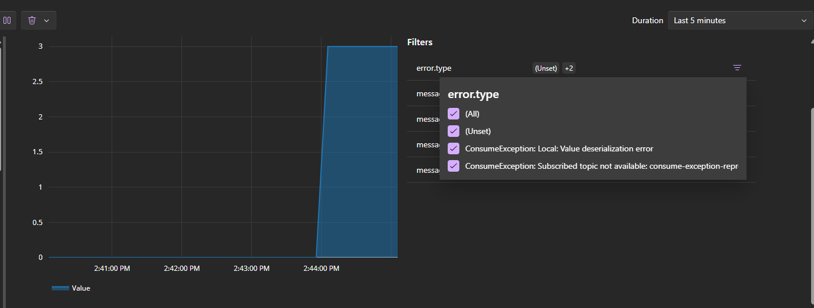
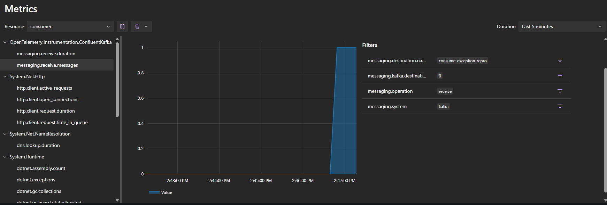

# Aspire Kafka ConsumeException Metrics Repro

This sample reproduces issue https://github.com/microsoft/aspire/issues/17655.

It creates an Aspire AppHost with Kafka and two worker services:

- Producer: sends one valid message and one poison message.
- Consumer: uses `Aspire.Confluent.Kafka` with a custom deserializer that throws for the poison message.

## Why this reproduces the bug

The consumer throws `ConsumeException` when processing the poison message.
According to the issue, `messaging.receive.duration` and `messaging.receive.messages` are not emitted for this failure path.

## Run

From this folder:

```powershell
dotnet restore
dotnet run --project .\AspireKafkaConsumeExceptionRepro.AppHost\AspireKafkaConsumeExceptionRepro.AppHost.csproj
```

Open the Aspire dashboard URL printed by AppHost.

## What to observe

1. In `consumer` logs, you should see successful consume of the GOOD message and then `ConsumeException` logs for the BAD message.
2. In dashboard metrics for the consumer process, compare successful receive telemetry to failed receive behavior.
3. The issue reproduces if failed consume attempts do not generate `messaging.receive.duration` and `messaging.receive.messages` with error attributes.

## Expected result

Failed consume attempts should still emit receive metrics for the consumer, with the failure captured through error attributes such as `error.type`.
Note: This scenario as tested with fix from https://github.com/microsoft/aspire/pull/17658.

- Reference image: [Results/Expected.png](./Results/Expected.png)



## Actual result

The current behavior only shows the successful receive metric point. The failed consume path logs `ConsumeException`, but the corresponding `messaging.receive.duration` and `messaging.receive.messages` telemetry is missing from the dashboard.

- Reference image: [Results/Actual.png](./Results/Actual.png)



## Projects

- `AspireKafkaConsumeExceptionRepro.AppHost`: declares Kafka resource and wires references.
- `AspireKafkaConsumeExceptionRepro.Producer`: publishes GOOD and BAD messages.
- `AspireKafkaConsumeExceptionRepro.Consumer`: consumes and throws in custom deserializer for BAD payload.
- `AspireKafkaConsumeExceptionRepro.ServiceDefaults`: telemetry and health defaults.
